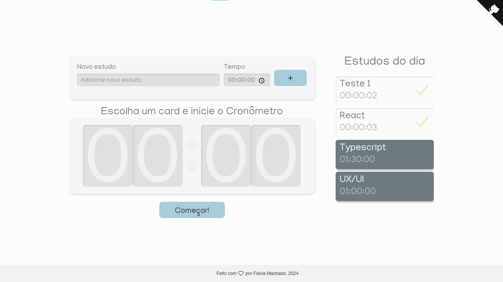

### Alura Studies - Study Management App with Timer

This project was developed during the React with TypeScript course from Alura. The application allows users to add study tasks and track the time spent on each one with the help of a timer. It's ideal for those who want to better organize their study time and monitor their daily activity progress.

### Features
- Add tasks: Add what you plan to study and how much time you want to dedicate to that activity.
- Timer: A timer you can start to track the time you're spending on each task.
- Task list: See all the tasks you've added and choose which one you want to start.
- Mark tasks as completed: Once you finish a task, it will be marked as completed, helping you track your progress.

## Technologies Used
- React: JavaScript library for building user interfaces.
- TypeScript: A superset of JavaScript that adds static typing.
- SCSS: CSS preprocessor to facilitate style creation and organization.
- React Hooks: useState for state management within the application.

 

# Getting Started with Create React App

This project was bootstrapped with [Create React App](https://github.com/facebook/create-react-app).

## Available Scripts

In the project directory, you can run:

### `npm start`

Runs the app in the development mode.\
Open [http://localhost:3000](http://localhost:3000) to view it in the browser.

The page will reload if you make edits.\
You will also see any lint errors in the console.

### `npm test`

Launches the test runner in the interactive watch mode.\
See the section about [running tests](https://facebook.github.io/create-react-app/docs/running-tests) for more information.

### `npm run build`

Builds the app for production to the `build` folder.\
It correctly bundles React in production mode and optimizes the build for the best performance.

The build is minified and the filenames include the hashes.\
Your app is ready to be deployed!

See the section about [deployment](https://facebook.github.io/create-react-app/docs/deployment) for more information.

### `npm run eject`

**Note: this is a one-way operation. Once you `eject`, you can’t go back!**

If you aren’t satisfied with the build tool and configuration choices, you can `eject` at any time. This command will remove the single build dependency from your project.

Instead, it will copy all the configuration files and the transitive dependencies (webpack, Babel, ESLint, etc) right into your project so you have full control over them. All of the commands except `eject` will still work, but they will point to the copied scripts so you can tweak them. At this point you’re on your own.

You don’t have to ever use `eject`. The curated feature set is suitable for small and middle deployments, and you shouldn’t feel obligated to use this feature. However we understand that this tool wouldn’t be useful if you couldn’t customize it when you are ready for it.

## Contributions 🤝
Contributions are welcome! If you have suggestions or improvements for the project, feel free to open an issue or submit a pull request.

## Learn More

You can learn more in the [Create React App documentation](https://facebook.github.io/create-react-app/docs/getting-started).

To learn React, check out the [React documentation](https://reactjs.org/).

 

> **Developed with 🤍 by Flávia Machado.**

